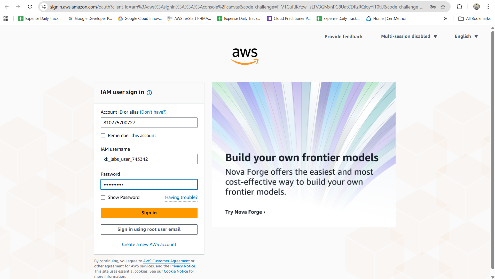
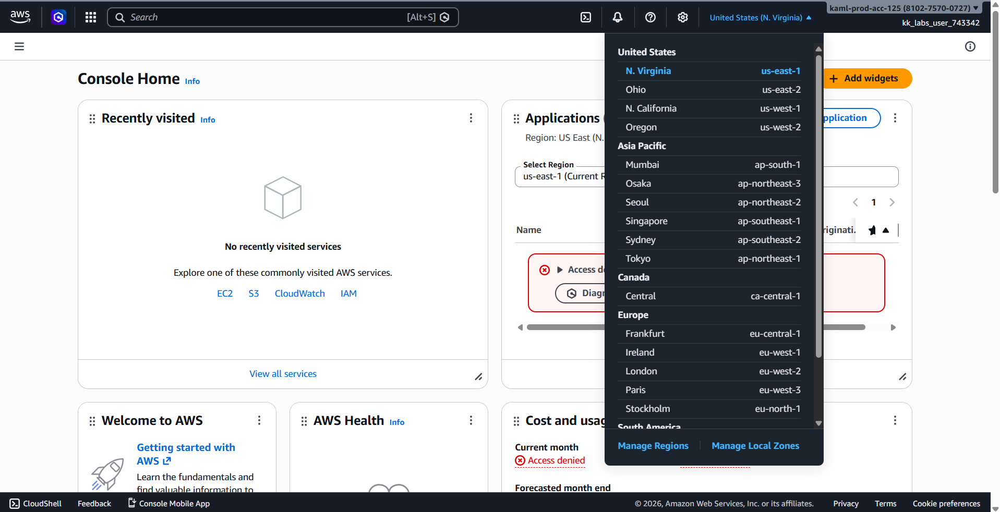
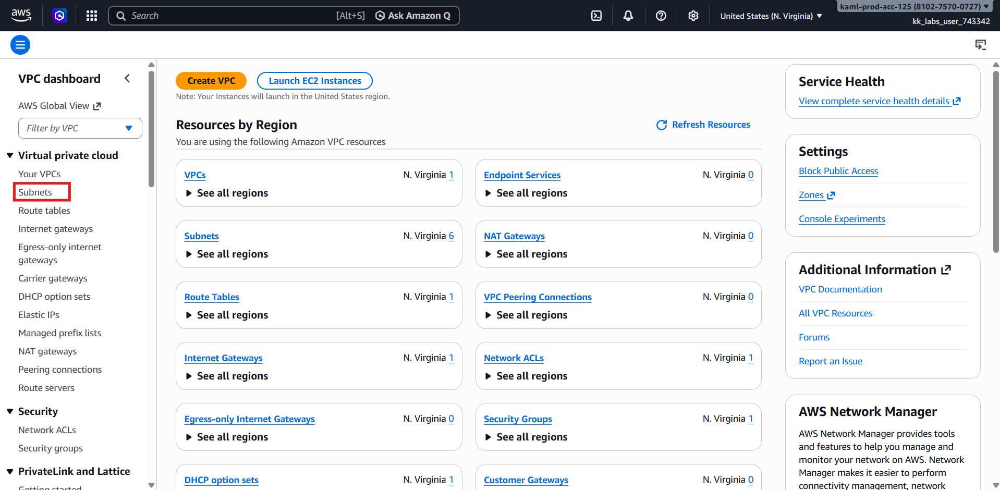
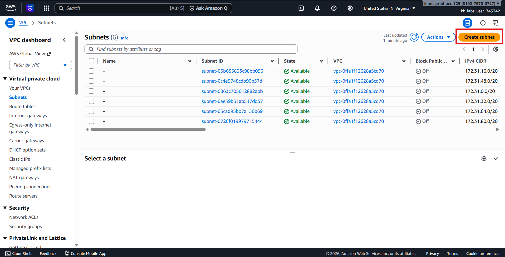
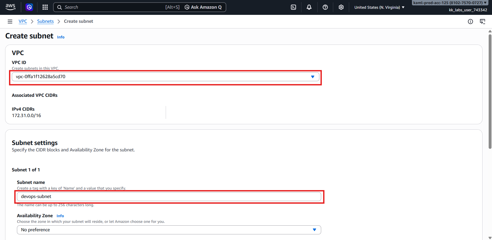
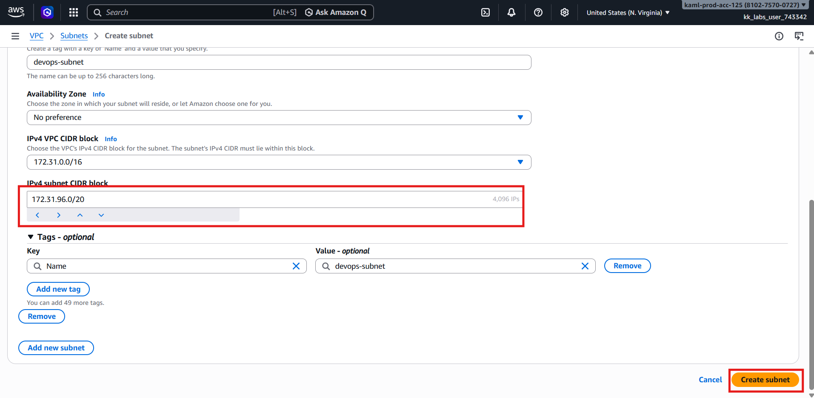
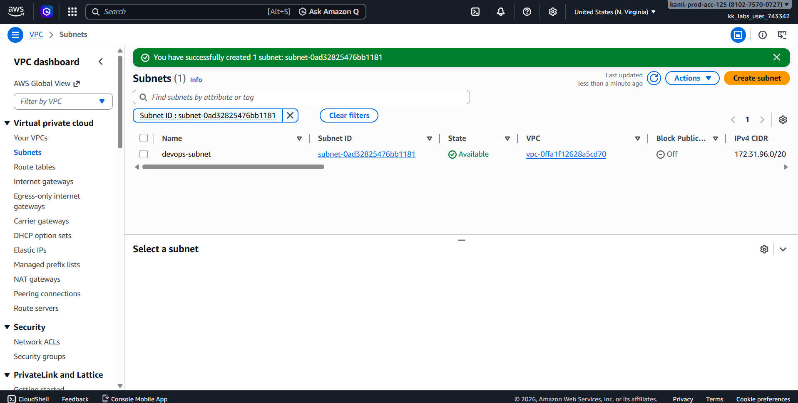
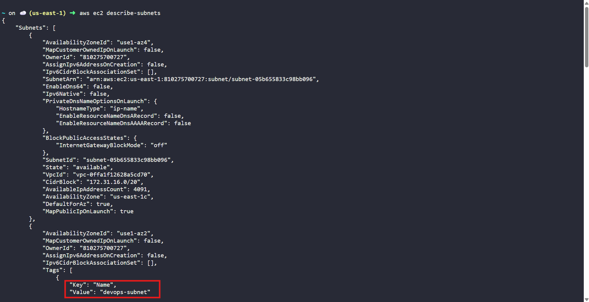

# 🚀 AWS Incremental Migration Task  
## 🌐 Create a Subnet in Default VPC (us-east-1)

---

## 🧩 Problem Overview

The **Nautilus DevOps Team** is migrating a portion of their infrastructure to **:contentReference[oaicite:0]{index=0} (AWS)** using an **incremental approach** rather than a single large migration.  

This strategy helps the team:
- Reduce migration risk  
- Maintain operational stability  
- Execute changes in controlled phases  

As part of this phased migration, a new **subnet** must be created.

---

## 🎯 Task Objective

Create **one subnet** with the following requirements:

| Requirement | Value |
|------------|------|
| **Subnet Name** | `devops-subnet` |
| **VPC** | Default VPC |
| **Region** | `us-east-1` |
| **Method** | AWS Management Console |

---

## 🔑 AWS Credentials (Provided)

> ⚠️ **Important:** These credentials are **temporary** and valid only within the given time window.

| Field | Value |
|------|------|
| **Console URL** | https://810275700727.signin.aws.amazon.com/console?region=us-east-1 |
| **Username** | `kk_labs_user_743342` |
| **Password** | `G!KF^e1n@2KJ` |
| **Start Time** | Tue Feb 24 22:53:39 UTC 2026 |
| **End Time** | Tue Feb 24 23:53:39 UTC 2026 |

---

## 🛠️ Solution — Using AWS Management Console (Preferred)

### Step 1️⃣: Log in to AWS Console
1. Open the **Console URL** provided above.
2. Log in using the given **username** and **password**.
3. Confirm successful login.



---

### Step 2️⃣: Verify the AWS Region
1. In the top-right corner of the console, locate the **Region selector**.
2. Ensure it is set to:
```text
us-east-1 (N. Virginia)
```



> ⚠️ Switch to **us-east-1** if another region is selected.

---

### Step 3️⃣: Open the VPC Service
1. From the AWS Console homepage, search for **VPC**.
2. Click **VPC** to open the VPC Dashboard.

---

### Step 4️⃣: Navigate to Subnets
1. In the left-hand navigation pane, click **Subnets**.



2. Click the **Create subnet** button.



---

### Step 5️⃣: Configure Subnet Details
Fill in the following information:

| Field | Value |
|-----|------|
| **VPC ID** | Default VPC |
| **Subnet name** | `devops-subnet` |
| **Availability Zone** | Any (e.g., `us-east-1a`) |
| **IPv4 CIDR block** | Any available range (e.g., `172.31.96.0/20`) |

> 💡 The CIDR block must fall within the default VPC CIDR range.




---

### Step 6️⃣: Create the Subnet
1. Review the configuration.
2. Click **Create subnet**.

---

### Step 7️⃣: Verify Subnet Creation
1. Ensure `devops-subnet` appears in the **Subnets** list.
2. Confirm:
   - VPC: Default VPC  
   - State: Available  
   - Region: `us-east-1`



3. Or verify using CLI
```bash
aws ec2 describe-subnets
```
> check subnet with the name: `devops-subnet`



---

## ✅ Final Validation Checklist

- [x] Subnet name is `devops-subnet`  
- [x] Created under **default VPC**  
- [x] Subnet is in **us-east-1** region  
- [x] Subnet state is **Available**  

---

## 🎉 Task Completed Successfully!

The subnet required for the Nautilus DevOps team’s incremental AWS migration has been created successfully and is ready to support future resources such as EC2 instances and application services.

---
