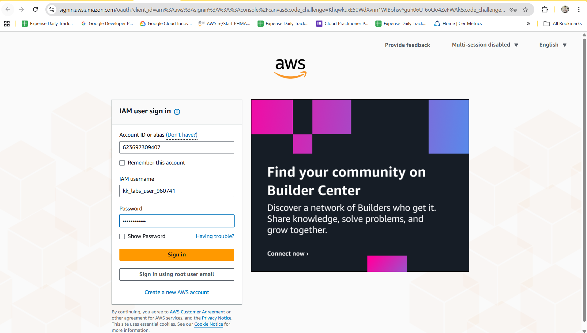
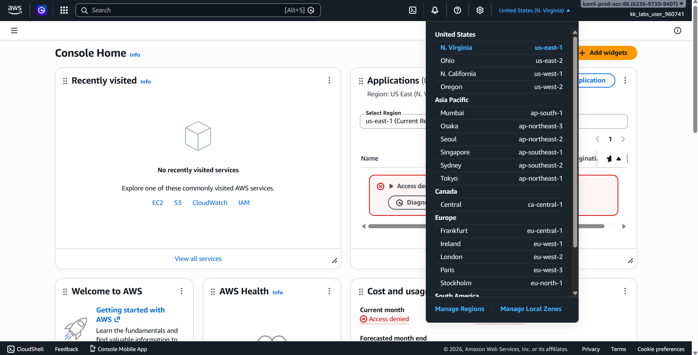
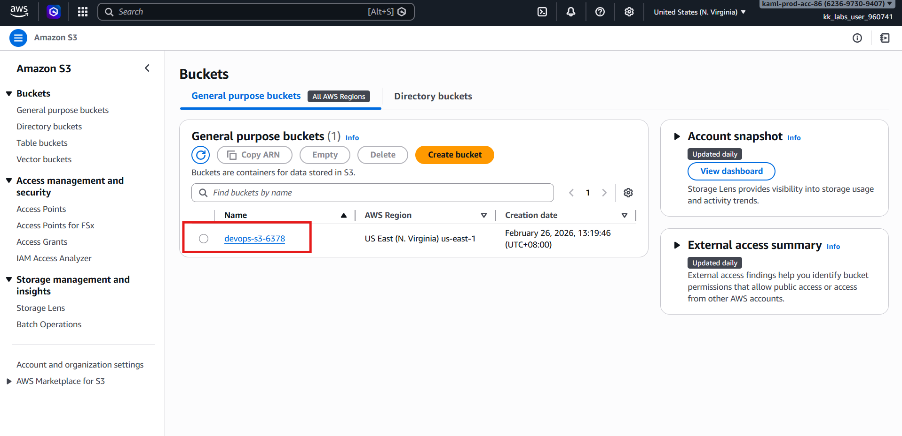
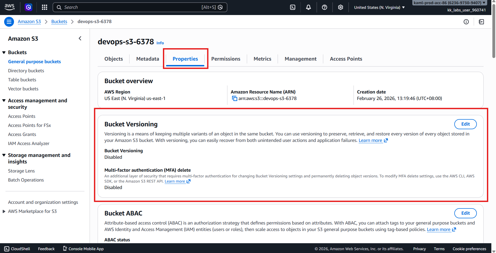
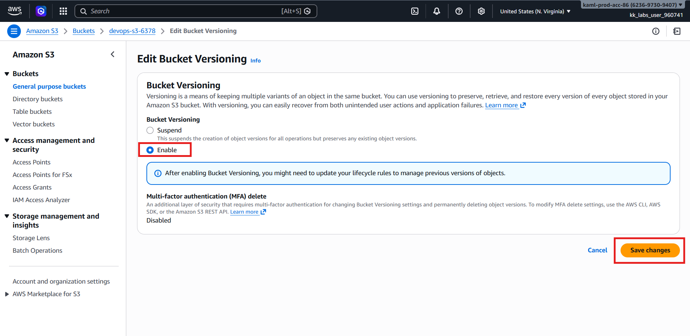
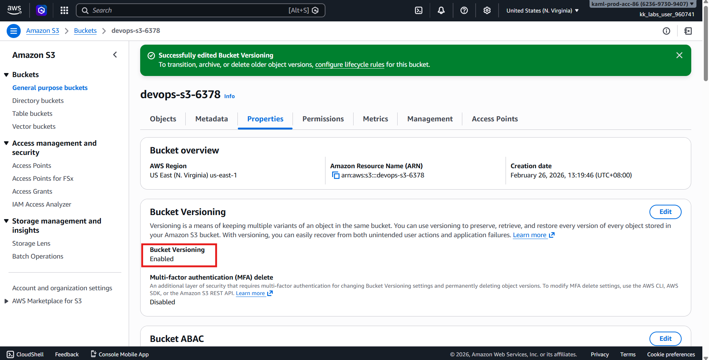
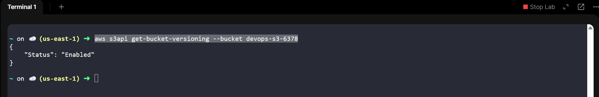

# 🚀 AWS Data Protection Task  
## 🪣 Enable Versioning on an S3 Bucket (us-east-1)

---

## 🧩 Problem Overview

Data protection and recovery are critical components of modern cloud operations.  
The **Nautilus DevOps Team** has been tasked with improving data resilience for an existing **Amazon S3** bucket by enabling **versioning**, ensuring that objects can be recovered in case of accidental deletion or overwrite.

This task supports:
- Data recovery and rollback
- Protection against accidental deletion
- Better compliance and audit readiness

---

## 🎯 Task Objective

Enable **versioning** for the following S3 bucket:

| Requirement | Value |
|------------|------|
| **Bucket Name** | `devops-s3-6378` |
| **Feature to Enable** | Versioning |
| **Region** | `us-east-1` |
| **Method** | AWS Management Console |

---

## 🔑 AWS Credentials (Provided)

> ⚠️ **Important:** Credentials are **temporary** and valid only within the specified time window.

| Field | Value |
|------|------|
| **Console URL** | https://623697309407.signin.aws.amazon.com/console?region=us-east-1 |
| **Username** | `kk_labs_user_960741` |
| **Password** | `2k15%eA3pM3t` |
| **Start Time** | Thu Feb 26 05:19:27 UTC 2026 |
| **End Time** | Thu Feb 26 06:19:27 UTC 2026 |

---

## 🛠️ Solution — Using AWS Management Console (Preferred)

---

### Step 1️⃣: Log in to AWS Console
1. Open the **Console URL** provided above.
2. Log in using the given **username** and **password**.
3. Confirm successful login.



---

### Step 2️⃣: Verify AWS Region
1. Check the **region selector** in the top-right corner.
2. Ensure the region is set to:
```text
us-east-1 (N. Virginia)
```



> ⚠️ Switch to **us-east-1** if a different region is selected.

---

### Step 3️⃣: Navigate to Amazon S3
1. From the AWS Console homepage, search for **S3**.
2. Click **S3** to open the **:contentReference[oaicite:1]{index=1}** dashboard.

---

### Step 4️⃣: Select the Target Bucket
1. In the list of buckets, click on:
```text
devops-s3-6378
```



---

### Step 5️⃣: Open Bucket Properties
1. Inside the bucket, click the **Properties** tab.
2. Scroll down to the **Bucket Versioning** section.



---

### Step 6️⃣: Enable Versioning
1. Click **Edit** under **Bucket Versioning**.
2. Select **Enable**.
3. Click **Save changes**.



---

### Step 7️⃣: Verify Versioning Status
1. Return to the **Properties** tab.
2. Confirm that **Bucket Versioning** now shows:
```text
Status: Enabled
```



3. Or check via CLI
```bash
aws s3api get-bucket-versioning --bucket devops-s3-6378
```



---

## ✅ Final Validation Checklist

- [x] Bucket name is `devops-s3-6378`  
- [x] Versioning status is **Enabled**  
- [x] Bucket is in **us-east-1** region  
- [x] Changes saved successfully  

---

## 🎉 Task Completed Successfully!

Versioning has been successfully enabled on the S3 bucket, ensuring improved data protection and recovery capabilities for the Nautilus DevOps team.

This bucket can now safely retain multiple versions of objects, allowing rollback and recovery whenever needed.

---
