# 🚀 AWS EC2 Optimization Task  
## 🔄 Change Instance Type (us-east-1)

---

## 🧩 Problem Overview

During the AWS migration process, the **Nautilus DevOps Team** identified an underutilized EC2 instance and decided to optimize costs by downsizing it.

The instance `datacenter-ec2` must be resized from:
```text
t2.micro → t2.nano
```


⚠️ Important: Ensure **Status Checks are completed** before making any changes.

---

## 🎯 Task Objective

| Requirement | Value |
|------------|------|
| **Instance Name** | `datacenter-ec2` |
| **Current Type** | `t2.micro` |
| **New Type** | `t2.nano` |
| **Final State** | Running |
| **Region** | `us-east-1` |
| **Method** | AWS Management Console |

---

## 🔑 AWS Credentials (Provided)

| Field | Value |
|------|------|
| **Console URL** | https://678838728594.signin.aws.amazon.com/console?region=us-east-1 |
| **Username** | `kk_labs_user_194324` |
| **Password** | `c%HYR@BrwO9F` |
| **Start Time** | Sun Mar 01 00:41:05 UTC 2026 |
| **End Time** | Sun Mar 01 01:41:05 UTC 2026 |

---

# 🛠️ Solution — Using AWS Management Console (Preferred)

## Step 1️⃣: Log in to AWS Console

1. Open the provided Console URL.
2. Sign in using the given credentials.
3. Confirm successful login.

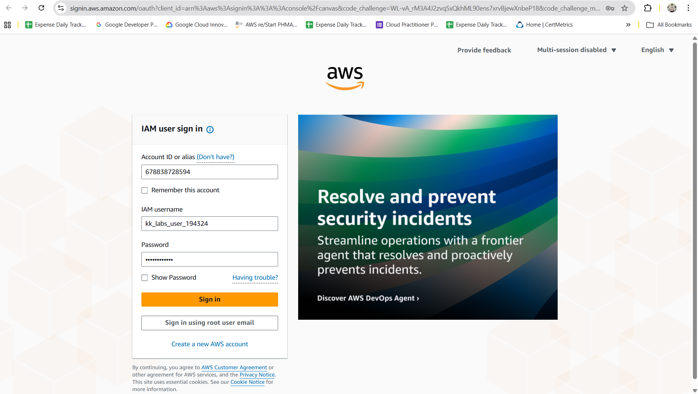

---

## Step 2️⃣: Verify Region

Ensure the region (top-right corner) is:
```text
us-east-1 (N. Virginia)
```

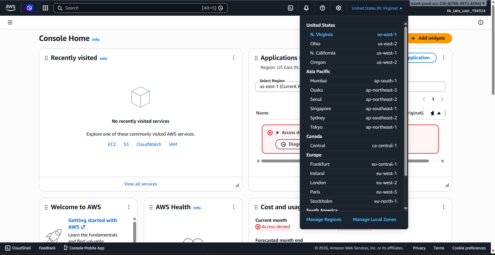

---

## Step 3️⃣: Navigate to EC2

1. Search for **EC2** in the AWS Console.
2. Open the EC2 Dashboard.
3. Click **Instances** in the left panel.

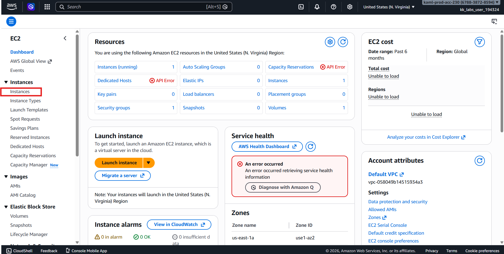

---

## Step 4️⃣: Locate the Instance

1. Find instance named:
```text
datacenter-ec2
```


2. Click the instance ID to open details.

---

## Step 5️⃣: Verify Status Checks

Under the **Status and alarms** tab:

Ensure:
```text
2/2 checks passed
```

⚠️ If still **Initializing**, wait until checks are completed before proceeding.

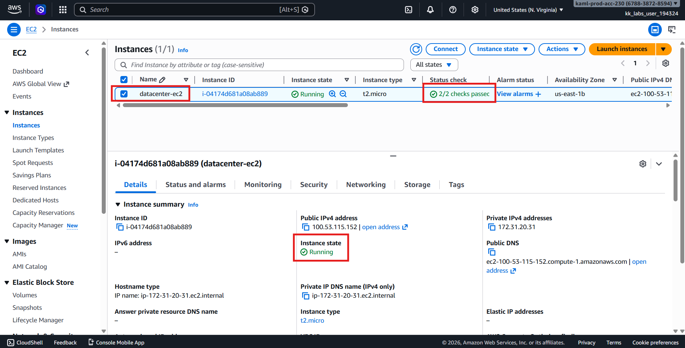

---

## Step 6️⃣: Stop the Instance

1. Select the instance.
2. Click **Instance state → Stop instance**.

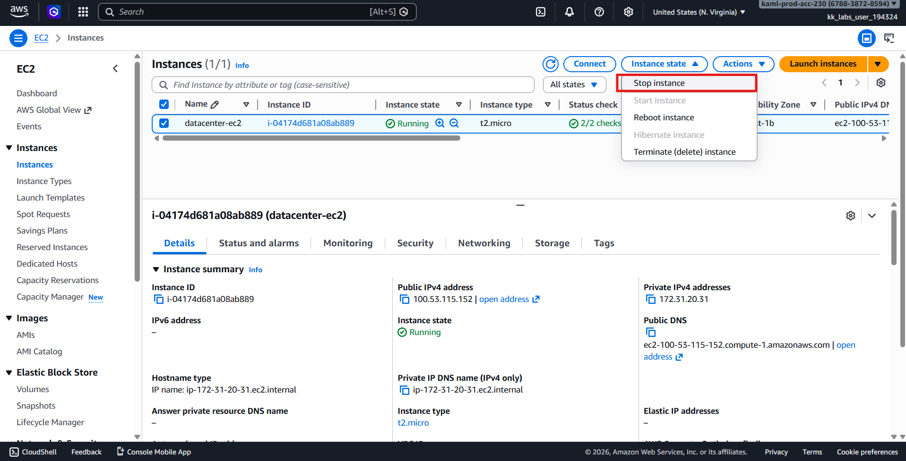

3. Wait until the instance state shows:
```text
Stopped
```

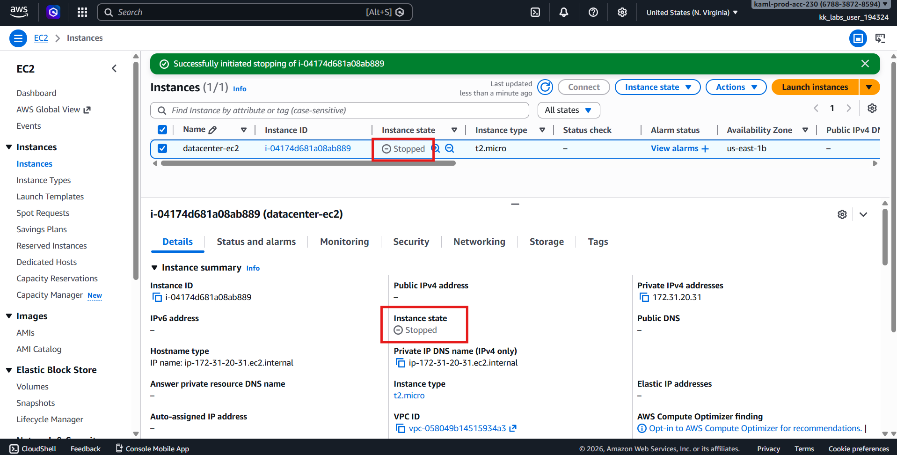

---

## Step 7️⃣: Change Instance Type

1. With the instance selected, click:
   - **Actions → Instance settings → Change instance type**

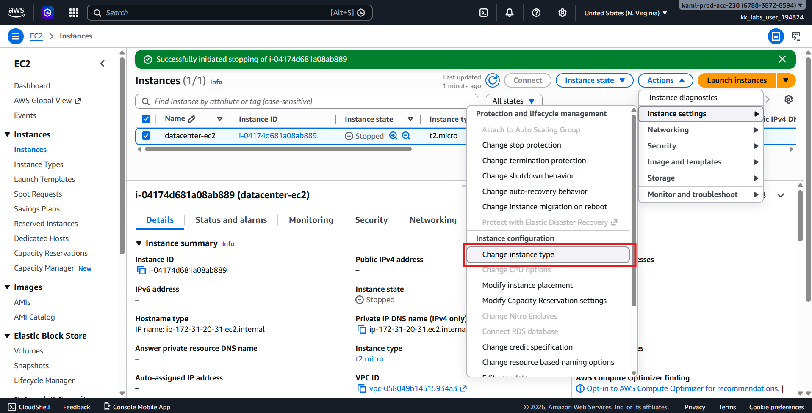

2. Select:
```text
t2.nano
```

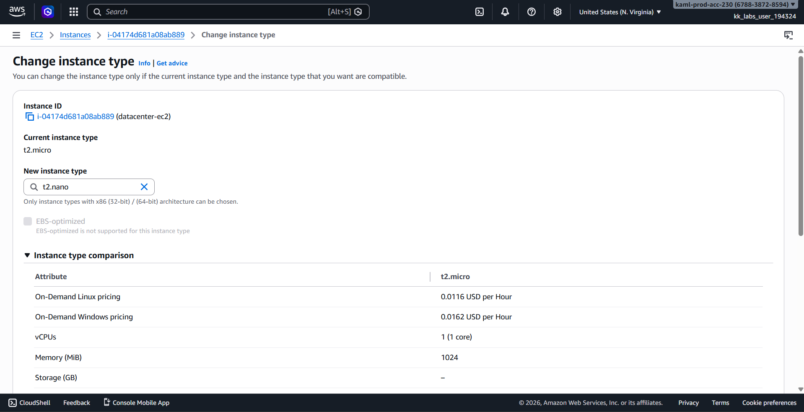

3. Click **Apply**.

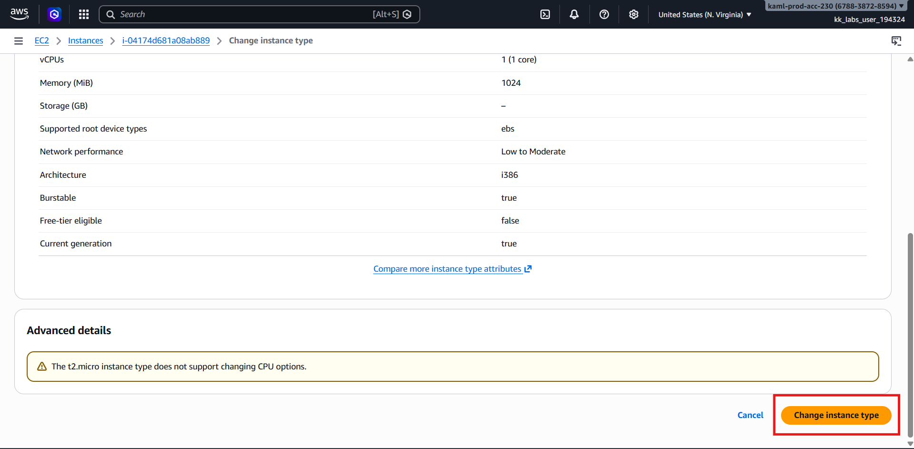

---

## Step 8️⃣: Start the Instance

1. Click **Instance state → Start instance**.

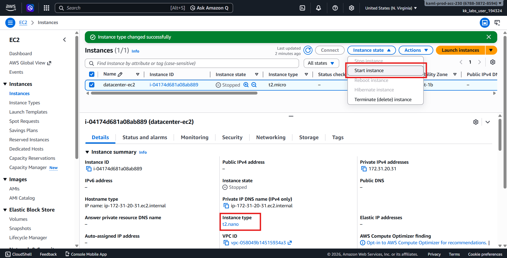

2. Wait until the instance state changes to:
```text
Running
```

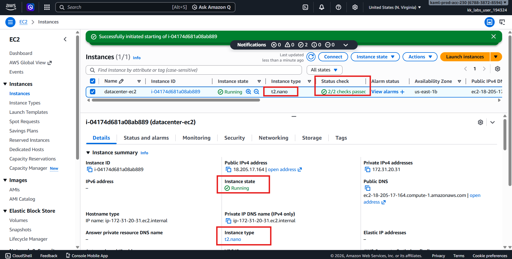

3. Or check via CLI
```bash
aws ec2 describe-instances \
  --region us-east-1 \
  --filters "Name=tag:Name,Values=datacenter-ec2" \
  --query "Reservations[*].Instances[*].[InstanceId,InstanceType]" \
  --output table
```

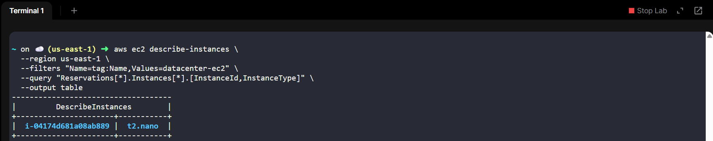

---

## Step 9️⃣: Final Verification

Confirm the following:

| Setting | Expected Value |
|----------|----------------|
| Name | `datacenter-ec2` |
| Instance Type | `t2.nano` |
| Instance State | Running |
| Status Checks | 2/2 Passed |
| Region | us-east-1 |

---

# ✅ Final Validation Checklist

- [x] Status checks completed before modification  
- [x] Instance stopped before resizing  
- [x] Instance type changed to `t2.nano`  
- [x] Instance restarted successfully  
- [x] Instance state is **Running**  
- [x] Status checks show **2/2 passed**

---

# 🎉 Task Completed Successfully!

The EC2 instance `nautilus-ec2` has been successfully resized from **t2.micro** to **t2.nano** and is now running, ensuring better cost optimization as part of the Nautilus DevOps team’s incremental AWS migration strategy.

---
