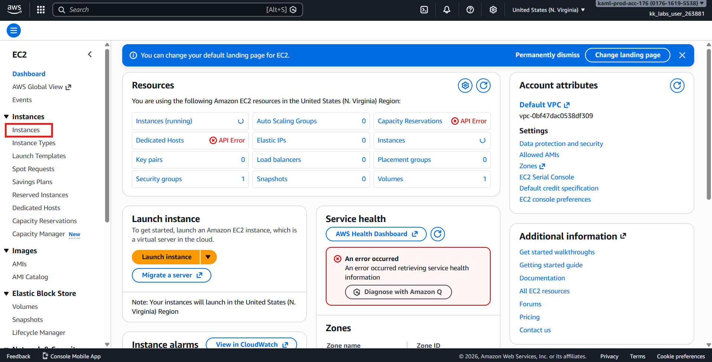
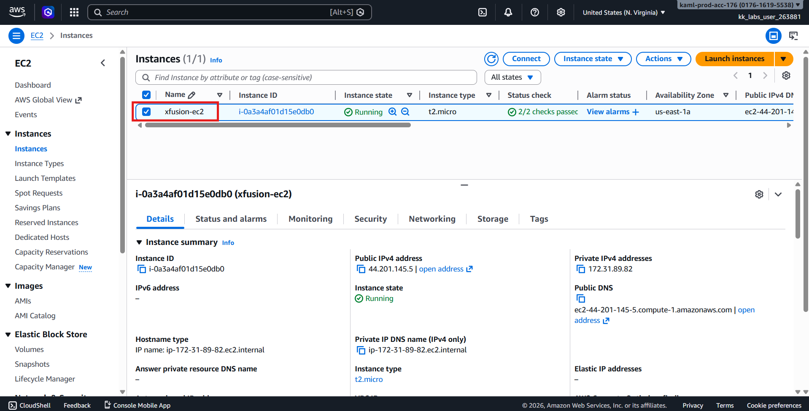
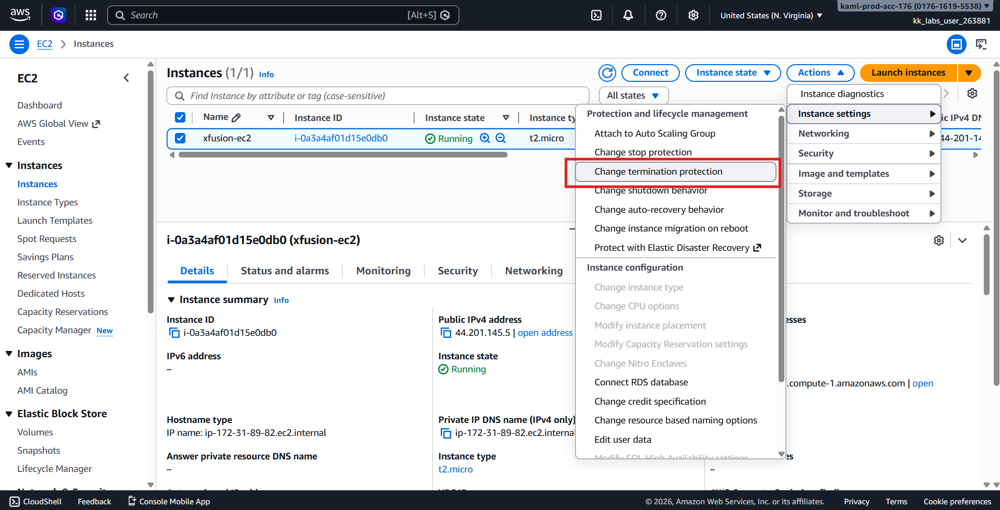
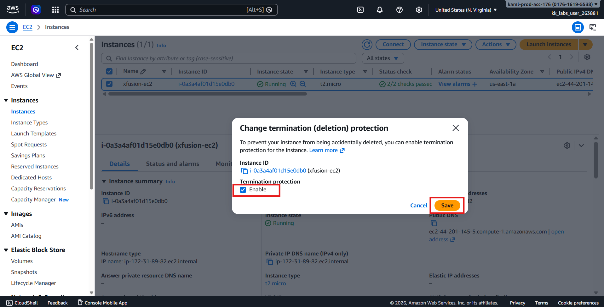
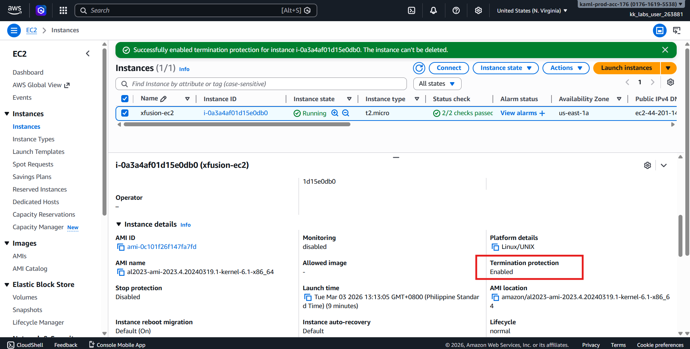
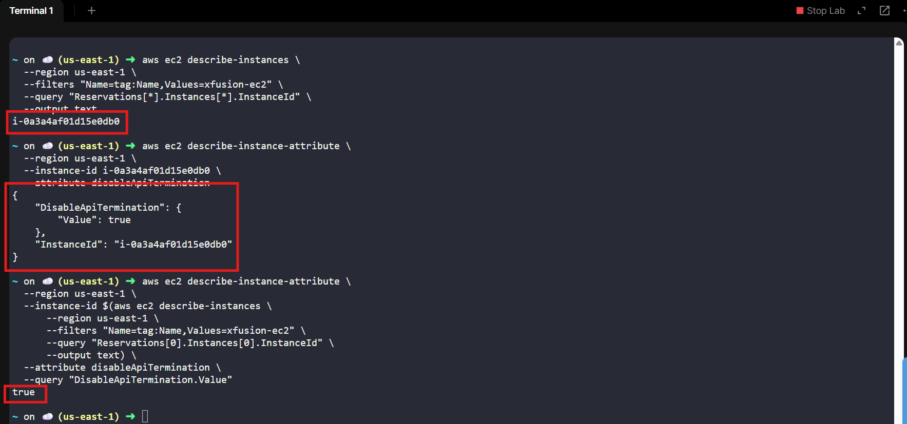

# 🚀 AWS EC2 Protection Task  
## 🛡️ Enable Termination Protection (us-east-1)

---

## 🧩 Problem Overview

During the AWS migration, the Nautilus DevOps team deployed several EC2 resources.  
One instance requires **termination protection** to prevent accidental deletion.

**Termination protection** ensures that an EC2 instance **cannot be terminated** unless the protection setting is explicitly disabled first — an important safeguard for production systems.

---

## 🎯 Task Objective

Enable **Termination Protection** for the existing EC2 instance:

| Requirement | Value |
|------------|------|
| **Instance Name** | `xfusion-ec2` |
| **Feature** | Termination Protection |
| **Region** | `us-east-1` |
| **Method** | AWS Management Console |

---

## 🔑 AWS Credentials (Provided)

> ⚠️ Credentials are temporary and valid only within the specified time window.

| Field | Value |
|------|------|
| **Console URL** | https://017616195538.signin.aws.amazon.com/console?region=us-east-1 |
| **Username** | `kk_labs_user_263881` |
| **Password** | `CX%M@%aFlDJ7` |
| **Start Time** | Tue Mar 03 05:12:43 UTC 2026 |
| **End Time** | Tue Mar 03 06:12:43 UTC 2026 |

---

# 🛠️ Solution — Using AWS Management Console (Preferred)

## Step 1️⃣: Log in to AWS Console

1. Open the provided **Console URL**.
2. Log in using the supplied credentials.
3. Confirm successful login.

---

## Step 2️⃣: Verify AWS Region

Ensure the region selector (top-right) shows:
```text
us-east-1 (N. Virginia)
```

> ⚠️ Change region if necessary.

---

## Step 3️⃣: Navigate to EC2 Dashboard

1. Search **EC2** from the AWS search bar.
2. Open the EC2 service.
3. Click **Instances** in the left navigation panel.



---

## Step 4️⃣: Locate the Instance

Find the instance named:
```text
xfusion-ec2
```

Select the checkbox beside the instance.



---

## Step 5️⃣: Enable Termination Protection

1. Click:
```text
Actions → Instance settings → Change termination protection
```



2. In the dialog window:
   - ✅ Enable **Termination protection**
3. Click **Save** or **Apply**.



---

## Step 6️⃣: Verify Protection Status

1. Select the instance again.
2. Open the **Details** tab.
3. Confirm the setting shows:
```text
Termination protection: Enabled
```



4. or verify via CLI

first: Get Instance ID from EC2 Name
```bash
aws ec2 describe-instances \
  --region us-east-1 \
  --filters "Name=tag:Name,Values=xfusion-ec2" \
  --query "Reservations[*].Instances[*].InstanceId" \
  --output text
```

> output: **i-0a3a4af01d15e0db0**

second: Check Termination Protection (use the instance id from above)
```bash
aws ec2 describe-instance-attribute \
  --region us-east-1 \
  --instance-id i-0a3a4af01d15e0db0 \
  --attribute disableApiTermination
```

output:
```bash
{
    "DisableApiTermination": {
        "Value": true
    },
    "InstanceId": "i-0a3a4af01d15e0db0"
}
```
> True -> means that the Termination Protection is Enabled

One Command:

```bash
aws ec2 describe-instance-attribute \
  --region us-east-1 \
  --instance-id $(aws ec2 describe-instances \
      --region us-east-1 \
      --filters "Name=tag:Name,Values=xfusion-ec2" \
      --query "Reservations[0].Instances[0].InstanceId" \
      --output text) \
  --attribute disableApiTermination \
  --query "DisableApiTermination.Value"
```
> Same output.



---

## ✅ Final Validation Checklist

- [x] Instance `xfusion-ec2` located in us-east-1  
- [x] Termination protection enabled  
- [x] Instance cannot be terminated accidentally  
- [x] Settings successfully saved  

---

## 🎉 Task Completed Successfully!

Termination protection has been successfully enabled for **xfusion-ec2**, protecting the instance from accidental deletion and ensuring operational stability during the migration process.

---
