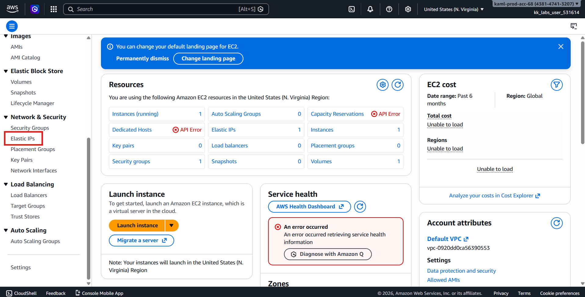
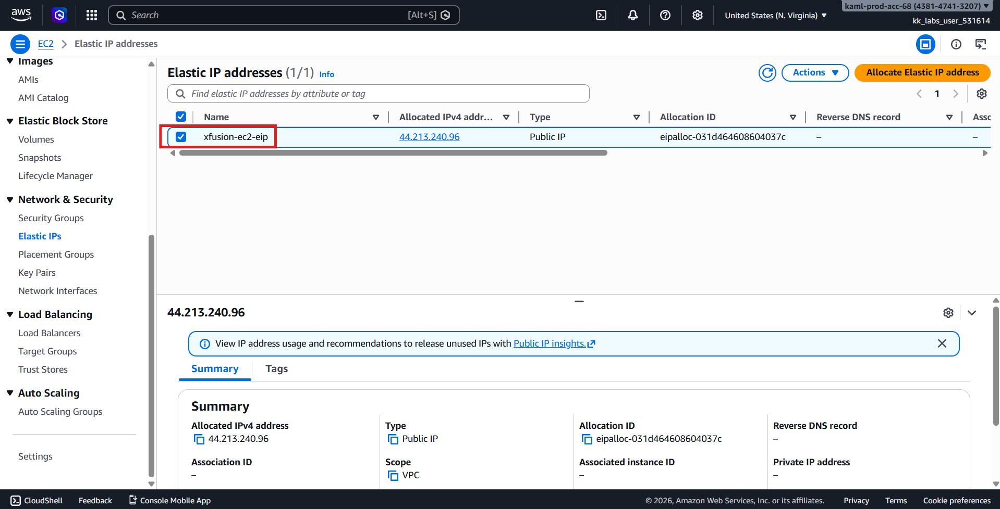
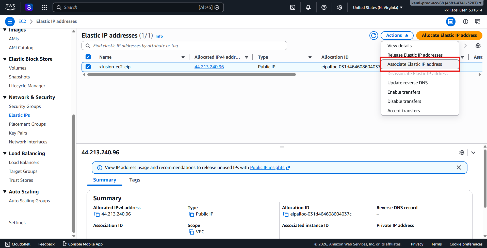
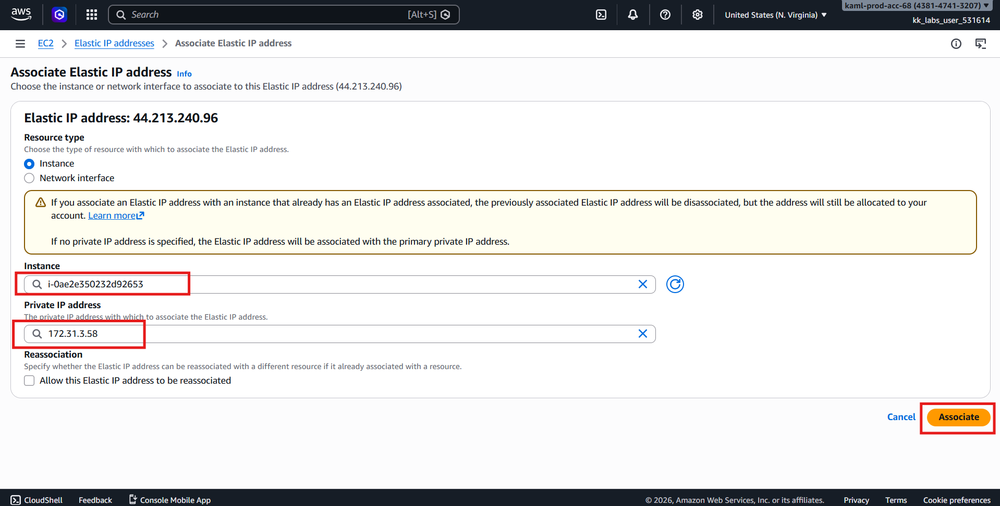
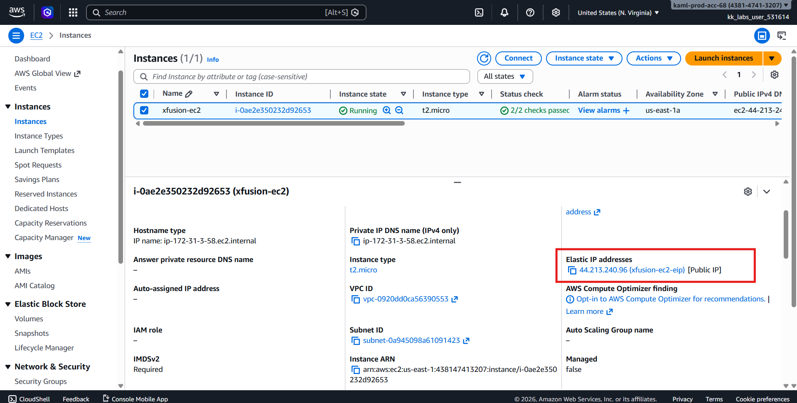
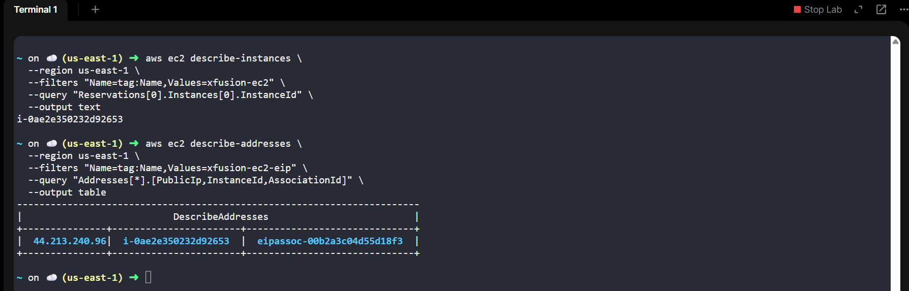

# 🚀 AWS EC2 Networking Task  
## 📌 Attach Elastic IP to an EC2 Instance (us-east-1)

---

## 🧩 Problem Overview

The **Nautilus DevOps Team** is performing incremental AWS migration and needs to associate an **Elastic IP (EIP)** with an existing EC2 instance.  

This ensures the instance has a **static public IP address** that persists across stop/start cycles.

---

## 🎯 Task Objective

Attach the following Elastic IP to the EC2 instance:

| Resource | Name |
|----------|------|
| **EC2 Instance** | `xfusion-ec2` |
| **Elastic IP** | `xfusion-ec2-eip` |
| **Region** | `us-east-1` |
| **Method** | AWS Management Console |

---

## 🔑 AWS Credentials (Provided)

> ⚠️ Temporary credentials valid only within the time window.

| Field | Value |
|------|------|
| **Console URL** | https://438147413207.signin.aws.amazon.com/console?region=us-east-1 |
| **Username** | `kk_labs_user_531614` |
| **Password** | `s4rs!zKQL0s@` |
| **Start Time** | Wed Mar 04 03:11:43 UTC 2026 |
| **End Time** | Wed Mar 04 04:11:43 UTC 2026 |

---

# 🛠️ Solution — Using AWS Management Console (Preferred)


::contentReference[oaicite:0]{index=0}


---

## Step 1️⃣: Log in to AWS Console

1. Open the **Console URL**.
2. Sign in using the provided credentials.
3. Confirm successful login.

---

## Step 2️⃣: Verify Region

Ensure the region selector (top-right) is set to:
```text
us-east-1 (N. Virginia)
```

> ⚠️ Switch to **us-east-1** if another region is selected.

---

## Step 3️⃣: Navigate to Elastic IPs

1. Search for **EC2** and open the EC2 Dashboard.
2. In the left-hand menu, scroll to **Network & Security → Elastic IPs**.



3. Locate the Elastic IP:
```text
xfusion-ec2-eip
```



---

## Step 4️⃣: Associate Elastic IP

1. Select `xfusion-ec2-eip`.
2. Click **Actions → Associate Elastic IP address**.



3. In the **Instance** dropdown, select:
```text
xfusion-ec2
```

4. Select the correct **private IP** (if prompted, typically the primary IP).
5. Click **Associate**.



---

## Step 5️⃣: Verify Association

1. Navigate to **Instances → xfusion-ec2**.
2. Check under **Description → Public IPv4 address**.
3. Confirm it now displays:
```text
xfusion-ec2-eip
```



4. or verify via CLI

First: Check Instance ID
```bash
aws ec2 describe-instances \
  --region us-east-1 \
  --filters "Name=tag:Name,Values=xfusion-ec2" \
  --query "Reservations[0].Instances[0].InstanceId" \
  --output text
```

**Output:**
```text
i-0ae2e350232d92653
```

Second: Check the EIP and its Association
```bash
aws ec2 describe-addresses \
  --region us-east-1 \
  --filters "Name=tag:Name,Values=xfusion-ec2-eip" \
  --query "Addresses[*].[PublicIp,InstanceId,AssociationId]" \
  --output table
```

**Output:**
| Public IP      | Instance ID          | EIP Association ID          |
|----------------|--------------------|----------------------------|
| 44.213.240.96  | i-0ae2e350232d92653 | eipassoc-00b2a3c04d55d18f3 |

Remarks:
- InstanceId (i-0ae2e350232d92653) = EC2 that the EIP is associated with.
- AssociationId exists (eipassoc-00b2a3c04d55d18f3) → EIP is attached.
- If InstanceId is null → EIP is not associated.



---

## ✅ Final Validation Checklist

- [x] EC2 instance: `xfusion-ec2`  
- [x] Elastic IP: `xfusion-ec2-eip` associated successfully  
- [x] Instance has the Elastic IP as **public IPv4 address**  
- [x] Region: `us-east-1`  

---

## 🎉 Task Completed Successfully!

The Elastic IP `xfusion-ec2-eip` has been successfully attached to the EC2 instance `xfusion-ec2`, ensuring it now has a static public IP for consistent access during the migration and operations.

---
