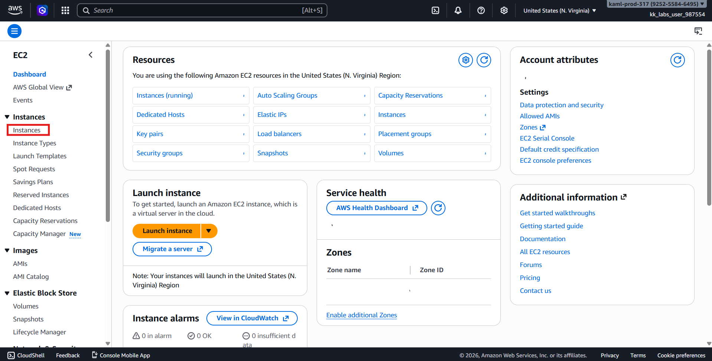
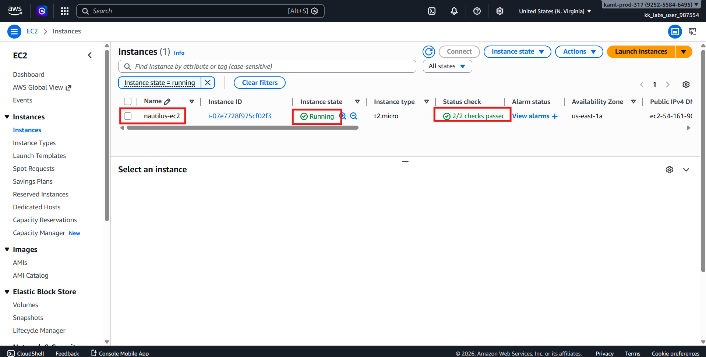
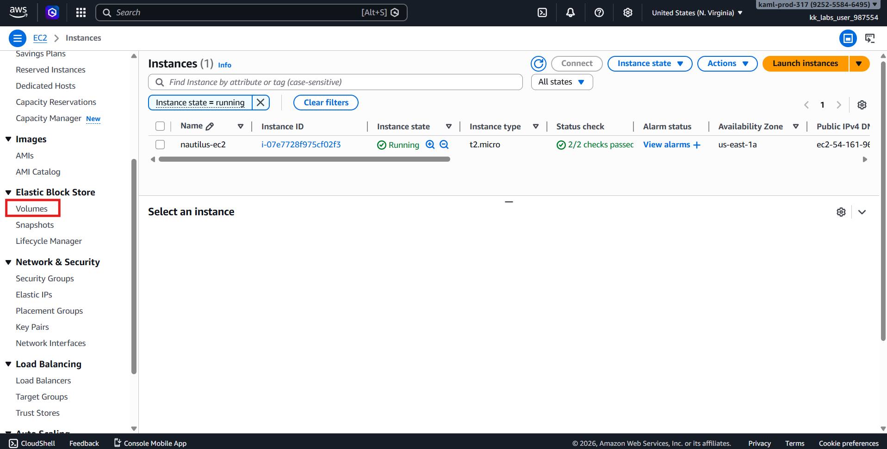
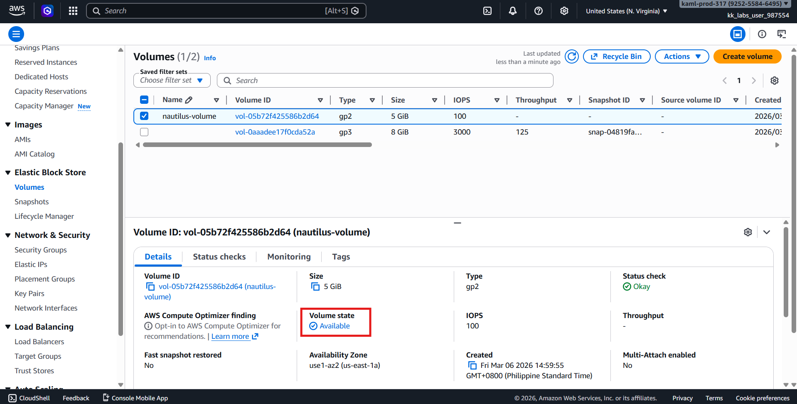
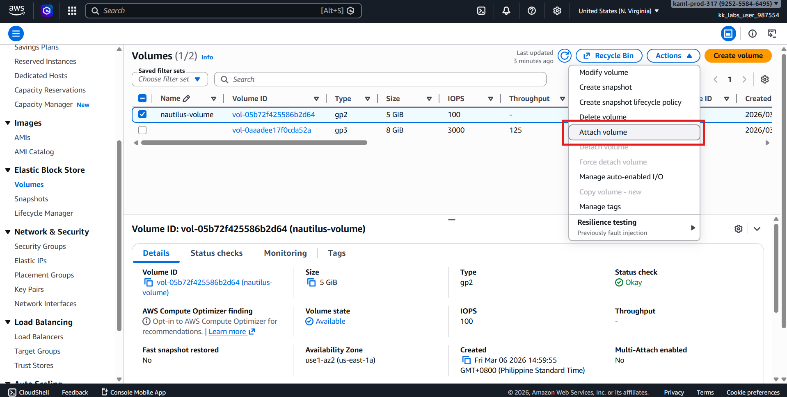
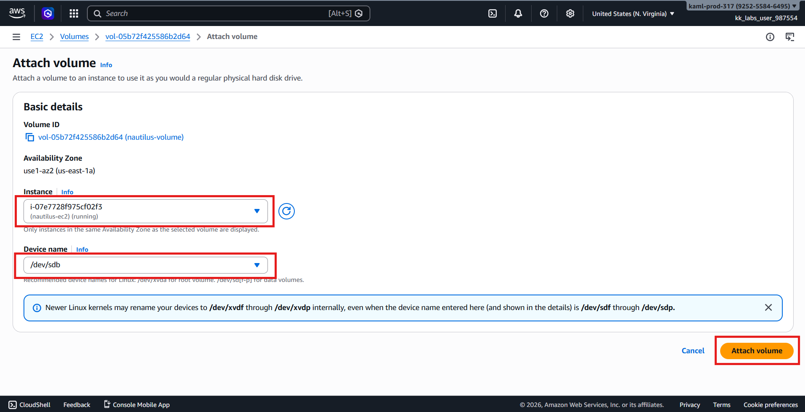
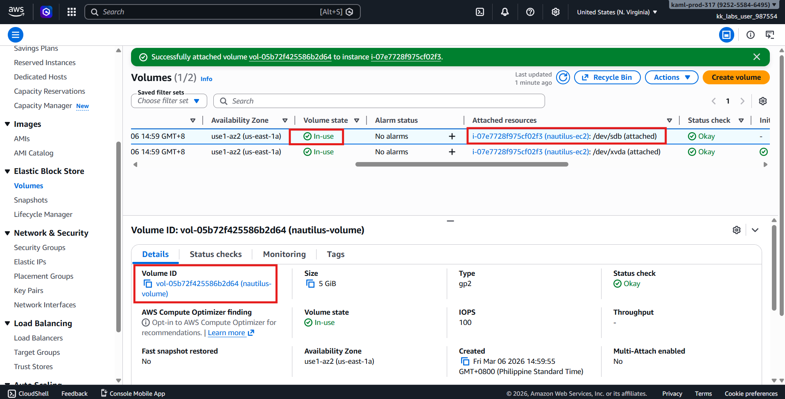
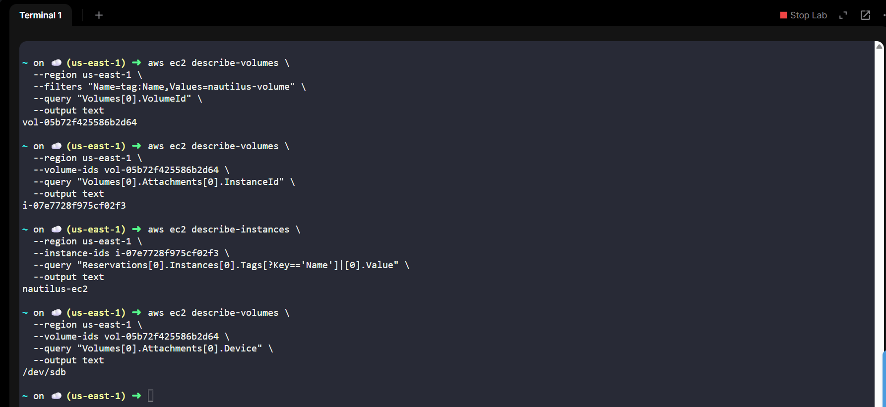

# 🚀 AWS Task: Attach EBS Volume to EC2 Instance (Console)

## 🧩 Scenario

The **Nautilus DevOps Team** is gradually migrating infrastructure to AWS.  
To maintain better control and reduce operational risks, they are executing the migration in smaller tasks.

In this task, an existing **EBS volume** needs to be attached to an existing **EC2 instance**.

---

# 🎯 Objective

Attach the existing **EBS volume** `nautilus-volume` to the EC2 instance `nautilus-ec2` using the device name:
```text
/dev/sdb
```

---

# 📋 Requirements

| Resource Type | Name |
|---------------|------|
| EC2 Instance | `nautilus-ec2` |
| EBS Volume | `nautilus-volume` |
| Device Name | `/dev/sdb` |
| Region | `us-east-1` |

---

# 🧭 Step 1 — Login to AWS Console

1. Open the provided **Console URL**.
2. Login using the given credentials.
3. Set the **region** to:
```text
us-east-1 (N. Virginia)
```

Region selector is located at the **top-right corner** of the console.

---

# 🖥️ Step 2 — Verify EC2 Instance

1. Navigate to:
```text
EC2 Dashboard → Instances
```



2. Locate the instance:
```text
nautilus-ec2
```


3. Verify the following:

| Check | Expected Status |
|------|----------------|
| Instance State | Running |
| Status Check | 2/2 checks passed |

⚠️ Wait if the instance is still **initializing**.



---

# 💾 Step 3 — Locate the Volume

1. From the EC2 left navigation menu go to:
```text
Elastic Block Store → Volumes
```



2. Search for the volume:
```text
nautilus-volume
```

3. Confirm the status:
```text
Available
```



---

# 🔗 Step 4 — Attach Volume to EC2

1. Select **nautilus-volume**.
2. Click **Actions**.
3. Choose:
```text
Attach volume
```



4. Configure the attachment:

| Setting | Value |
|--------|------|
| Instance | `nautilus-ec2` |
| Device name | `/dev/sdb` |

5. Click:
```text
Attach volume
```



---

# ✅ Step 5 — Verify Attachment

After attaching:

1. Refresh the **Volumes** page.
2. Check the **Attachment information**.

Expected results:

| Property | Expected Value |
|---------|----------------|
| Volume State | `In-use` |
| Instance | `nautilus-ec2` |
| Device | `/dev/sdb` |



3. or verify using CLI

First: Get the Volume ID from the Volume Name
Volumes use tags for their names.
```bash
aws ec2 describe-volumes \
  --region us-east-1 \
  --filters "Name=tag:Name,Values=nautilus-volume" \
  --query "Volumes[0].VolumeId" \
  --output text
```

> Output: **vol-05b72f425586b2d64**
> Tags for nautilus-volume

Second: Check Which Instance the Volume Is Attached To
```bash
aws ec2 describe-volumes \
  --region us-east-1 \
  --volume-ids vol-05b72f425586b2d64 \
  --query "Volumes[0].Attachments[0].InstanceId" \
  --output text
```

> Output: **i-07e7728f975cf02f3**

Third: Get the EC2 Name
```bash
aws ec2 describe-instances \
  --region us-east-1 \
  --instance-ids i-07e7728f975cf02f3 \
  --query "Reservations[0].Instances[0].Tags[?Key=='Name']|[0].Value" \
  --output text
```

> output: nautilus-ec2

Fourth: Check the Device Name of the Attachment
```bash
aws ec2 describe-volumes \
  --region us-east-1 \
  --volume-ids vol-05b72f425586b2d64 \
  --query "Volumes[0].Attachments[0].Device" \
  --output text
```

> output: /dev/sdb



---

# ✔️ Validation Checklist

- [x] Logged into AWS Console  
- [x] Region set to `us-east-1`  
- [x] Located `nautilus-ec2` instance  
- [x] Located `nautilus-volume` volume  
- [x] Volume attached successfully  
- [x] Device name set to `/dev/sdb`  
- [x] Volume state shows **In-use**

---

# 🏁 Result

The **EBS Volume (`nautilus-volume`)** has been successfully attached to the **EC2 instance (`nautilus-ec2`)** using device name:
