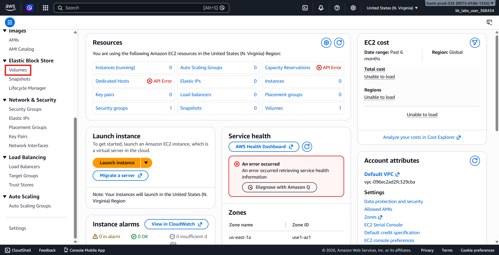
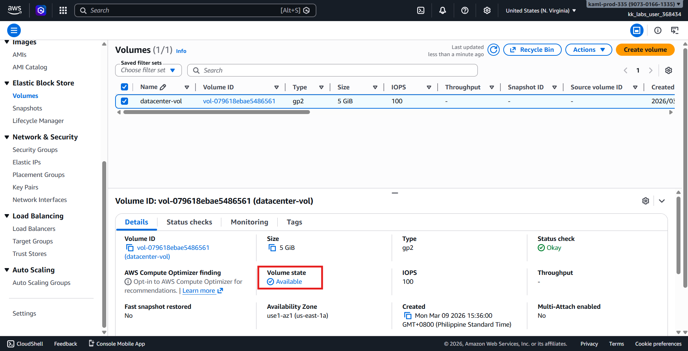
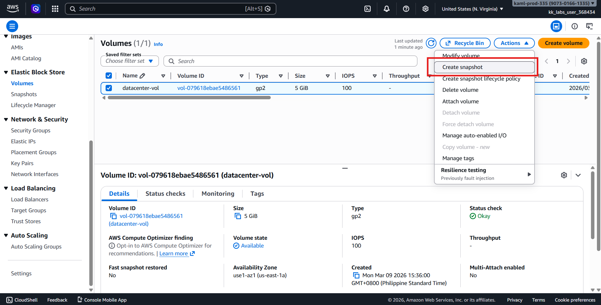
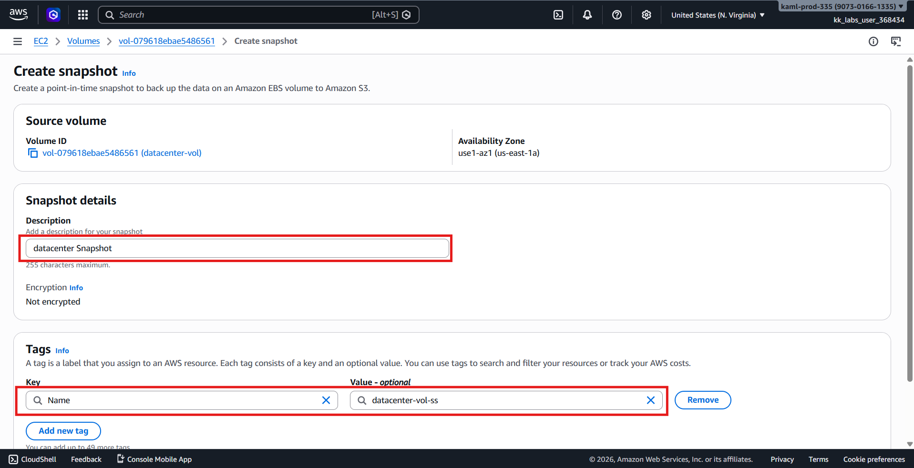
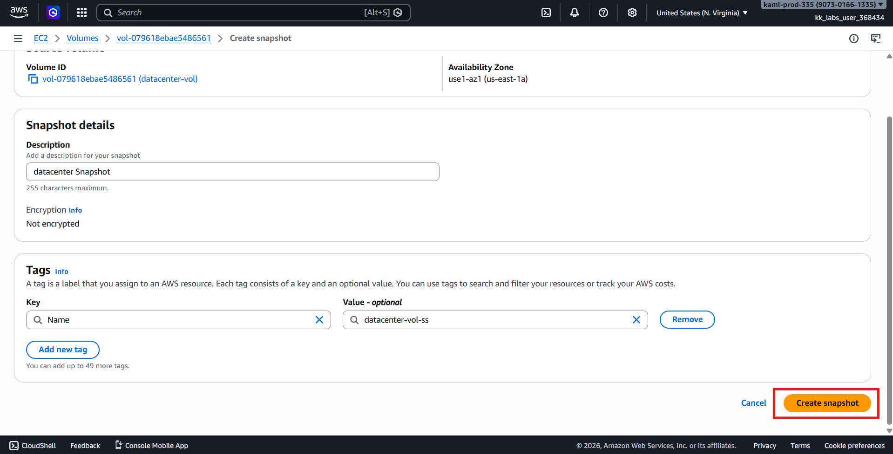
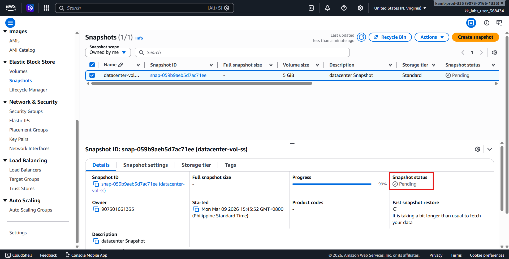
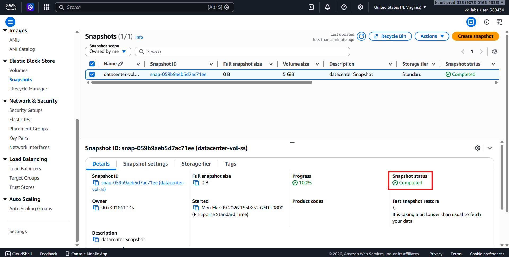
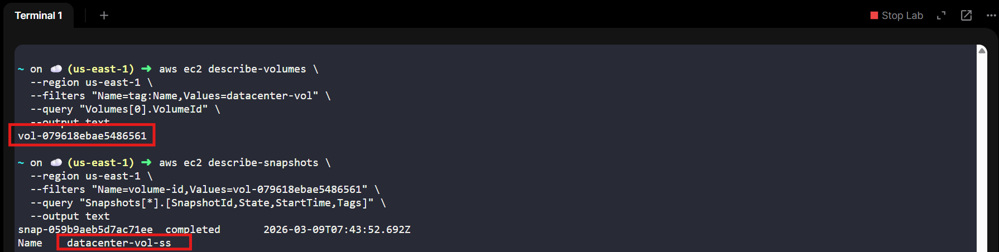

# 🚀 AWS Task: Create Snapshot of EBS Volume (Console)

## 🧩 Scenario

The **Nautilus DevOps Team** manages multiple volumes in different AWS regions.  
To ensure **data protection** and implement **automated backups**, they need snapshots of important EBS volumes.  

In this task, an existing volume must be snapshotted.

---

## 🎯 Objective

Create a snapshot for the existing **EBS volume** with the following details:

| Resource | Name |
|---------|------|
| EBS Volume | `datacenter-vol` |
| Snapshot Name | `datacenter-vol-ss` |
| Description | `datacenter Snapshot` |
| Region | `us-east-1` |

Ensure the snapshot reaches the **Completed** status before submitting.

---

## 🧭 Step 1 — Login to AWS Console

1. Open the provided **Console URL**.
2. Sign in using the credentials:

| Username | Password |
|----------|---------|
| `kk_labs_user_368434` | `bE@AnN032%P!` |

3. Set the **region** to:
```text
us-east-1 (N. Virginia)
```

---

## 🖥️ Step 2 — Navigate to Volumes

1. Open the **EC2 Dashboard**.
2. Click **Elastic Block Store → Volumes**.



3. Locate the volume:
```text
datacenter-vol
```

4. Confirm the **status** is:
```text
Available
```



---

## 💾 Step 3 — Create Snapshot

1. Select **datacenter-vol**.
2. Click **Actions → Create Snapshot**.



3. Configure snapshot details:

| Setting | Value |
|---------|-------|
| Name | `datacenter-vol-ss` |
| Description | `datacenter Snapshot` |



4. Click:
```text
Create Snapshot
```



---

## 🔄 Step 4 — Monitor Snapshot Creation

1. Navigate to:
```text
EC2 Dashboard → Snapshots
```
2. Search for:
```text
datacenter-vol-ss
```



3. Wait until the **Status** changes from **Pending → Completed**.



---

## ✅ Step 5 — Verify Snapshot

Expected snapshot details:

| Property | Expected Value |
|---------|----------------|
| Snapshot Name | `datacenter-vol-ss` |
| Description | `datacenter Snapshot` |
| Volume | `datacenter-vol` |
| Status | `Completed` |

or verify via CLI

First: Get the Volume ID from the Name Tag

```python
aws ec2 describe-volumes \
  --region us-east-1 \
  --filters "Name=tag:Name,Values=datacenter-vol" \
  --query "Volumes[0].VolumeId" \
  --output text
```

> Output: **vol-079618ebae5486561**

Second: List Snapshots for the Volume

```python
aws ec2 describe-snapshots \
  --region us-east-1 \
  --filters "Name=volume-id,Values=vol-079618ebae5486561" \
  --query "Snapshots[*].[SnapshotId,State,StartTime,Tags]" \
  --output text
```

> Output: snap-059b9aeb5d7ac71ee  completed  2026-03-09T07:43:52.692Z Name **datacenter-vol-ss**



---

## ✔️ Validation Checklist

- [x] Logged into AWS Console  
- [x] Region set to `us-east-1`  
- [x] Located volume `datacenter-vol`  
- [x] Snapshot created with name `datacenter-vol-ss`  
- [x] Snapshot description matches `datacenter Snapshot`  
- [x] Snapshot status is **Completed**

---

## 🏁 Result

The **EBS volume `datacenter-vol`** has been successfully snapshotted.  
The snapshot **`datacenter-vol-ss`** is now in **Completed** status.

---

## 💡 Key Concepts

- **EBS Snapshots** for backup and recovery
- Incremental snapshots for efficient storage
- Monitoring snapshot status in AWS Console
- Automating backup strategies for cloud workloads
