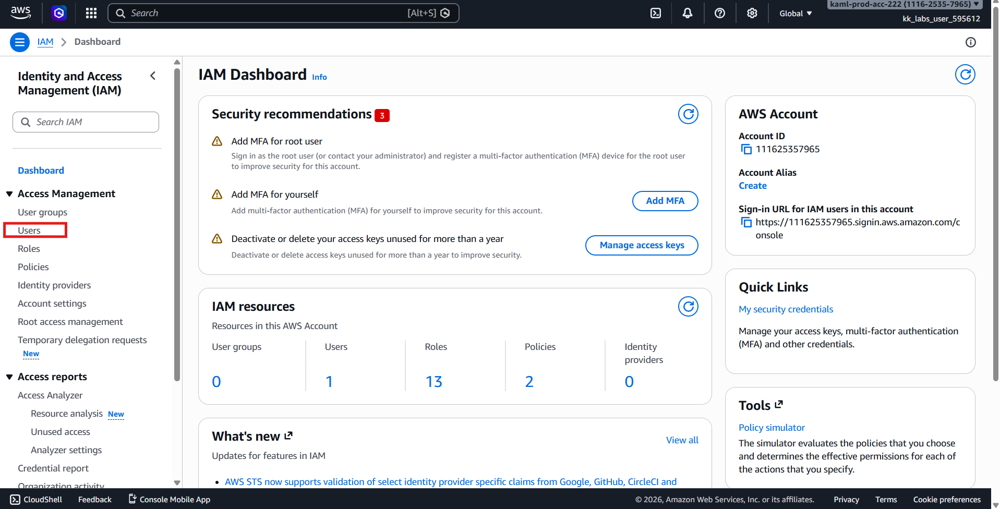
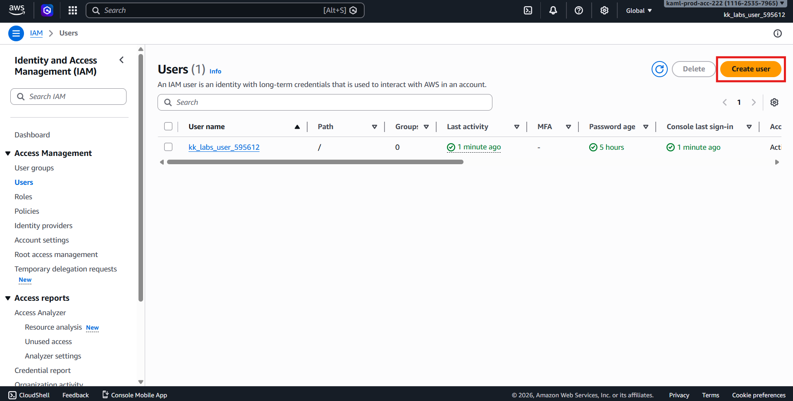
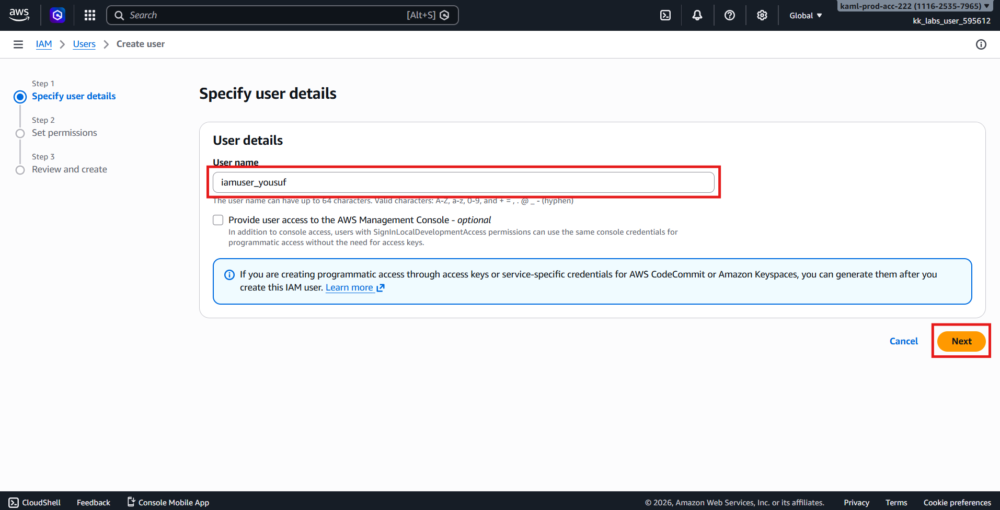
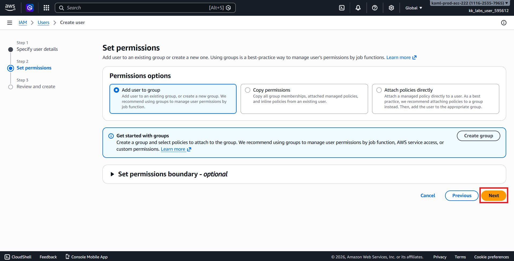
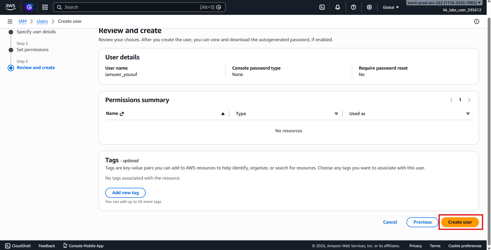
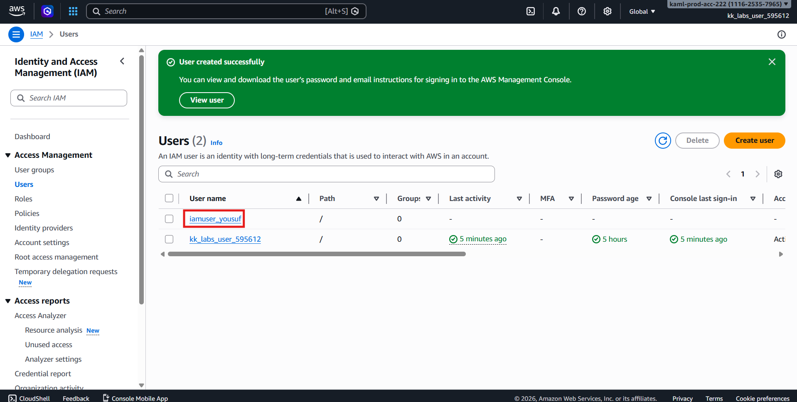
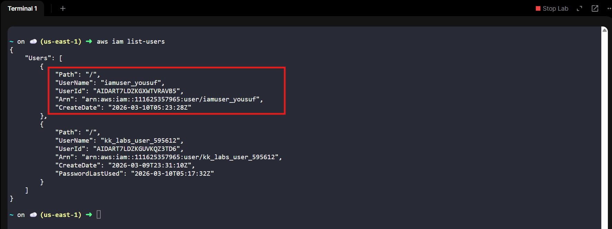

# 🚀 AWS Task: Create IAM User

## 🧩 Scenario

When setting up infrastructure in AWS, **Identity and Access Management (IAM)** is one of the first and most important services to configure.  
IAM enables secure control over access to AWS resources by managing users, permissions, and authentication.

The **Nautilus DevOps Team** needs to create a new IAM user as part of their access management setup.

---

# 🎯 Objective

Create an IAM user with the following details:

| Resource | Value |
|---------|-------|
| IAM User Name | `iamuser_yousuf` |
| Region | `us-east-1` *(IAM is global but use requested region)* |

---

# 🧭 Step 1 — Login to AWS Console

1. Open the provided **AWS Console URL**.
2. Sign in using the provided credentials.
3. Confirm region (top-right corner):
```text
us-east-1 (N. Virginia)
```

> ✅ Note: IAM is a **global service**, but labs require working under the specified region.

---

# 👤 Step 2 — Open IAM Service

1. From the AWS Console search bar, type:
```text
IAM
```

2. Click **IAM** under Services.

---

# ➕ Step 3 — Create IAM User

1. In the left navigation panel, click:
```text
Users
```



2. Click:
```text
Create user
```



---

# ⚙️ Step 4 — Configure User Details

Enter the following:

| Setting | Value |
|---------|-------|
| User name | `iamuser_yousuf` |



### Permissions
- Leave permissions **empty** (no policies required unless specified).

Click:
```text
Next
```



---

# 📋 Step 5 — Review and Create

1. Review configuration.
2. Click:
```text
Create user
```



---

# ✅ Step 6 — Verify User Creation

After creation:

1. You will see a success message.
2. Confirm the user appears in the Users list:
```text
iamuser_yousuf
```



3. or verify via CLI
```bash
aws iam list-users
```



---

# ✔️ Validation Checklist

- [x] Logged into AWS Console
- [x] Opened IAM service
- [x] Created user `iamuser_yousuf`
- [x] User visible in IAM Users list

---

# 🏁 Result

The IAM user **`iamuser_yousuf`** has been successfully created and is now available for permission assignment and access configuration.

---

# 💡 Key Concepts

- IAM Users represent individual identities in AWS
- IAM is a **global service**
- Principle of Least Privilege (permissions added later)
- Secure identity management in AWS environments
