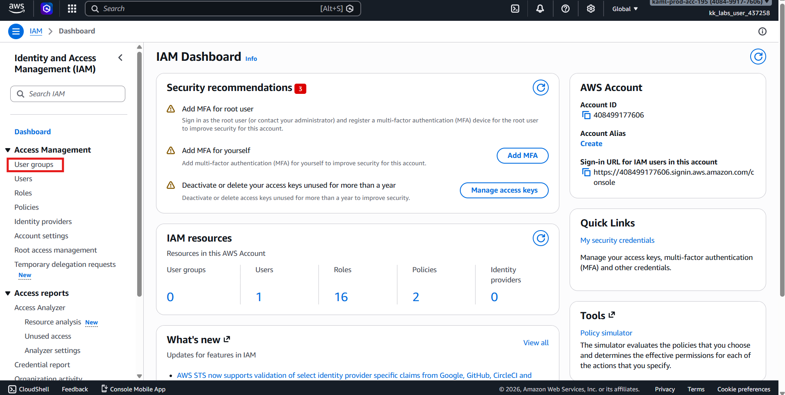
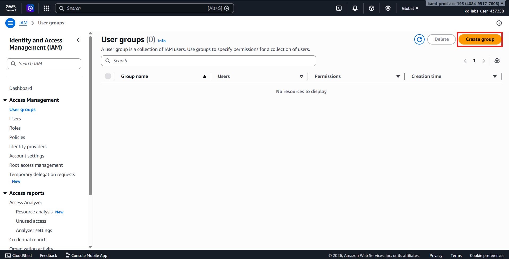
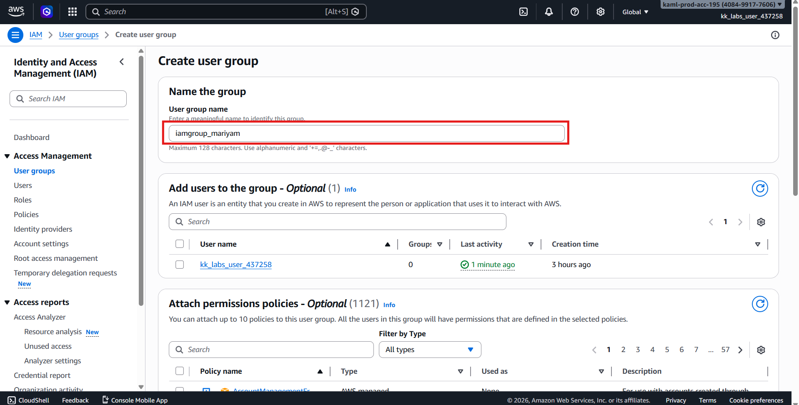
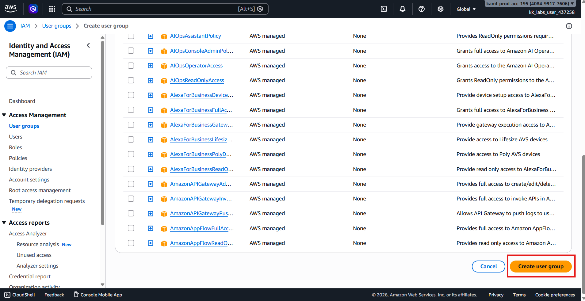
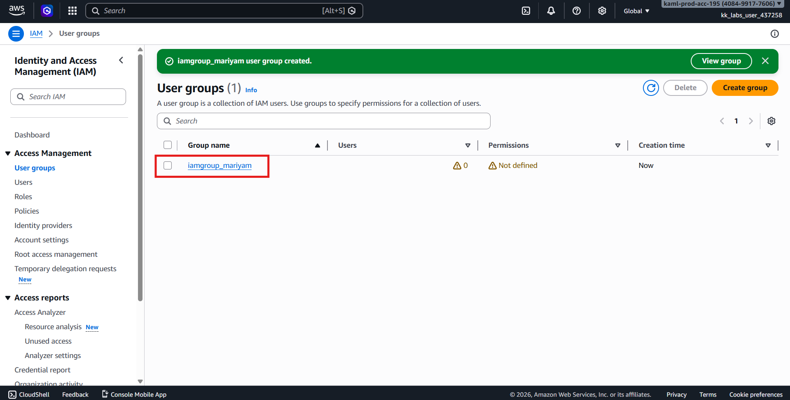
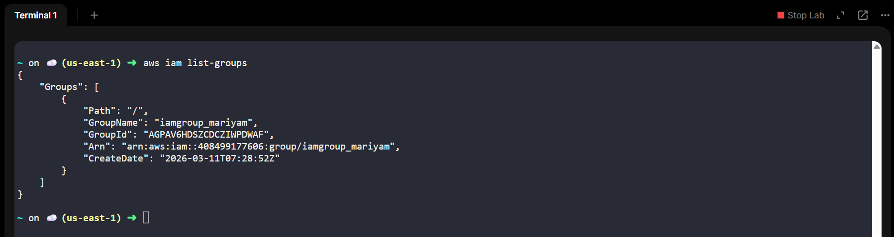

# 🚀 AWS Task: Create IAM Group (Console)

## 🧩 Scenario

As part of their AWS migration, the **Nautilus DevOps Team** is configuring Identity and Access Management (IAM) resources to organize users and permissions efficiently.

IAM **Groups** allow administrators to assign permissions to multiple users collectively, simplifying access management.

---

# 🎯 Objective

Create an IAM group with the following details:

| Resource | Value |
|---------|-------|
| IAM Group Name | `iamgroup_mariyam` |
| Region | `us-east-1` *(IAM is global but follow lab requirement)* |

---

# 🧭 Step 1 — Login to AWS Console

1. Open the provided **AWS Console URL**.
2. Login using the supplied credentials.
3. Confirm the selected region:
```text
us-east-1 (N. Virginia)
```

> ✅ IAM is a **global service**, but always work under the required region for lab validation.

---

# 👥 Step 2 — Open IAM Service

1. In the AWS Console search bar, type:
```text
IAM
```

2. Click **IAM** from the Services list.

---

# 📂 Step 3 — Navigate to Groups

1. In the left navigation panel, click:
```text
User groups
```



2. Click:
```text
Create group
```



---

# ⚙️ Step 4 — Configure Group Details

Enter the required information:

| Setting | Value |
|---------|-------|
| User group name | `iamgroup_mariyam` |



### Attach permissions
- Leave permissions **empty** (no policies required unless specified).

Click:
```text
Create group
```



---

# ✅ Step 5 — Verify Group Creation

1. After creation, you will return to the **User groups** page.
2. Confirm the group exists:
```text
iamgroup_mariyam
```



3. or check via CLI
```text
aws iam list-groups
```



---

# ✔️ Validation Checklist

- [x] Logged into AWS Console  
- [x] Opened IAM service  
- [x] Navigated to User Groups  
- [x] Created group `iamgroup_mariyam`  
- [x] Group visible in IAM Groups list  

---

# 🏁 Result

The IAM group **`iamgroup_mariyam`** has been successfully created and is ready for users and permission policies to be assigned.

---

# 💡 Key Concepts

- IAM Groups simplify permission management
- Permissions are assigned once and inherited by users
- Supports scalable identity management
- Follows AWS security best practices
